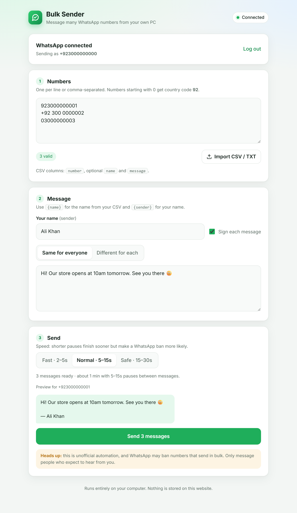

# WhatsApp Bulk Sender

Send a WhatsApp message to many numbers at once, from your own computer, using your own WhatsApp account.
**Download one file, double-click it, scan the QR code, and send.** Use one message for everyone or a
different message for each number.

<p align="center">
  <a href="https://github.com/Dev-Husnain/WhatsAppBulkSender/releases/latest/download/WhatsAppBulkSender.exe"><b>⬇ Download for Windows</b></a>
  &nbsp;·&nbsp;
  <a href="https://wabulksenderhussnain.netlify.app">Open the web page</a>
  &nbsp;·&nbsp;
  <a href="#run-from-source">Run from source (Mac / Linux)</a>
</p>

<p align="center">
  <picture>
    <source media="(prefers-color-scheme: dark)" srcset="docs/screenshot-dark.png">
    
  </picture>
</p>

> [!WARNING]
> This project automates WhatsApp Web and is **not affiliated with, endorsed by, or connected to WhatsApp or Meta**.
> Automating WhatsApp is against its Terms of Service, and **your number can be banned**, especially
> when sending to many people or to people who don't have you saved. Use it at your own risk, test with
> a spare number first, and **only message people who expect to hear from you.** Don't use it for spam.

---

## Contents

- [Features](#features)
- [Quick start (Windows)](#quick-start-windows)
- [How it works](#how-it-works)
- [Using the web page](#using-the-web-page)
- [Contacts file format](#contacts-file-format)
- [Sending speed](#sending-speed)
- [Security and privacy](#security-and-privacy)
- [Run from source](#run-from-source)
- [Terminal version](#terminal-version)
- [Configuration](#configuration)
- [Building and releasing](#building-and-releasing)
- [Project structure](#project-structure)
- [Troubleshooting](#troubleshooting)
- [License](#license)

---

## Features

- **One file, nothing to install:** a single `WhatsAppBulkSender.exe` that uses the Chrome or Edge already on your PC.
- **Your own WhatsApp:** log in by scanning a QR code, just like WhatsApp Web. The login is saved for next time.
- **No WhatsApp window:** WhatsApp runs in a hidden browser in the background.
- **Flexible messages:** one message for everyone, a separate message per number, or messages from a CSV file.
- **Attachments:** send an image, PDF, document, audio or video (up to 150 MB by default) to everyone, or a different file per number. The message can go as the file's caption.
- **Placeholders:** `{name}` inserts the contact's name and `{sender}` inserts your name. Any CSV column works as `{column}`.
- **Sender name:** optionally sign every message with `— Your Name`.
- **Any number format:** `+92 300 1234567`, `0300-1234567` and `923001234567` all work. Duplicates are removed.
- **Safe sending:** random pauses between messages, with Fast, Normal and Safe speeds.
- **Live progress:** see each number as sent, failed or not on WhatsApp, and stop at any time.
- **Results log:** every attempt is saved to `results.csv`.
- **Dark and light mode:** the page follows your system theme and works on small screens.

## Quick start (Windows)

1. **[Download `WhatsAppBulkSender.exe`](https://github.com/Dev-Husnain/WhatsAppBulkSender/releases/latest/download/WhatsAppBulkSender.exe)**
   (also on the [Releases](https://github.com/Dev-Husnain/WhatsAppBulkSender/releases) page and the
   [web page](https://wabulksenderhussnain.netlify.app)).
2. **Double-click it.** A small window opens (keep it open while sending) and your browser opens the page.
   > Windows may show **"Windows protected your PC"** because the app isn't code-signed. Click
   > **More info → Run anyway**. Your browser may also warn about downloading an `.exe`; choose **Keep**.
3. **Scan the QR code** on the page with your phone: WhatsApp → **Settings → Linked devices → Link a device**.
4. Add numbers, write your message, and click **Send**.

Next time, just double-click the exe. You stay logged in. To stop, close the small window.

**Requirements:** Windows 10 or 11 (64-bit), with Google Chrome or Microsoft Edge (Edge comes with Windows).

## How it works

```
 ┌────────────────────┐   http://localhost:3000   ┌──────────────────────────┐          ┌──────────┐
 │  Web page          │ ────────────────────────▶ │  WhatsAppBulkSender.exe  │ ───────▶ │ WhatsApp │
 │  localhost:3000    │   numbers + messages      │  on YOUR computer        │ hidden   │  servers │
 │  or Netlify        │ ◀──────────────────────── │  (Node + whatsapp-web.js)│ browser  │          │
 └────────────────────┘   QR code, live progress  └──────────────────────────┘          └──────────┘
```

The **sender** (the exe) runs on your computer. It uses [whatsapp-web.js](https://github.com/wwebjs/whatsapp-web.js)
to open WhatsApp Web in a hidden Chrome or Edge window, logged in to your account. The **web page** is only the
interface. The exe serves it at `http://localhost:3000`, and a hosted copy lives at
[wabulksenderhussnain.netlify.app](https://wabulksenderhussnain.netlify.app). Either way, the page always talks
to the sender on **the computer it's opened on**.

That's why the sender has to run on each person's PC. WhatsApp needs a browser that stays logged in, and
static web hosting like Netlify can't provide that. It also keeps every user's WhatsApp separate.

## Using the web page

1. **Connect WhatsApp:** scan the QR code. The first time, loading your chats can take up to a minute.
   After that, it connects in about 5 seconds.
2. **Numbers:** type or paste them (one per line or comma-separated), or click **Import CSV / TXT**.
3. **Message:**
   - Enter **your name** and tick **Sign each message** to add `— Your Name` at the end.
   - Choose **Same for everyone** or **Different for each**. When you import a CSV with a `message` column,
     it switches to **Different for each** and fills those in for you.
4. **Attachment (optional):** click **Attach file** to send the same file to everyone. In **Different for each**,
   click **Attach** next to a number to give that person their own file. Keep **Send message as caption** ticked
   to put the text under the file, or untick it to send the file and the text as two messages. A message is
   optional when a file is attached.
5. **Send:** pick a speed, check the preview bubble, and click **Send**. Progress appears live, and you can
   **Stop** at any time.

Files are sent from your PC straight to WhatsApp. They're held in the sender's memory only until they're sent.
The default limit is 150 MB per file. Raise it with `MAX_UPLOAD_MB` (up to about 190 MB, see [Configuration](#configuration)).
Sending files in bulk looks more like spam than text, so prefer the **Normal** or **Safe** speed.

Use **Log out** on the page to unlink WhatsApp from this computer.

## Contacts file format

**CSV:** a `number` column is required. `name`, `message` and any other columns are optional.

```csv
number,name,message
923000000001,Ali,"Hi {name}, your order is ready!"
+92 300 0000002,Sara,
03000000003,Ahmed,"Custom message just for Ahmed"
```

- Rows with an empty `message` use the message you type.
- Wrap messages that contain commas in double quotes.
- **Terminal version only:** add a `file` column with a file path (absolute, or relative to the folder you run
  from) to send that row its own attachment, e.g. `923000000001,Ali,"Your invoice",invoices/ali.pdf`. On the
  web page, use the **Attach** buttons instead.
- Any column can be used as a placeholder. A `city` column, for example, becomes `{city}`.

**TXT:** one number per line.

**Number rules:** spaces, `+`, `-` and brackets are removed. A leading `00` is dropped, and a leading `0` is
replaced with the country code (default `92`, see [Configuration](#configuration)). Numbers must end up
10–15 digits long, otherwise they are skipped as invalid.

## Sending speed

| Speed | Pause between messages | 50 messages take about |
|---|---|---|
| Fast | 2–5 s | 3 min |
| Normal | 5–15 s | 8 min |
| Safe | 15–30 s | 19 min |

Shorter pauses finish sooner but look more like spam to WhatsApp. Use **Fast** only for small lists of people
who know you.

## Security and privacy

- **Everyone uses their own number.** The sender runs on each person's own computer with their own WhatsApp
  login. Opening the shared page never gives anyone access to someone else's WhatsApp.
- **Local only.** The sender listens on `127.0.0.1`, so other devices on your network can't reach it.
- **Trusted pages only.** Requests are accepted only from `localhost`, the hosted page and any pages in
  `ALLOWED_ORIGINS`. Requests with any other `Host` header are rejected, which blocks other websites, including
  [DNS rebinding](https://en.wikipedia.org/wiki/DNS_rebinding) attacks that could otherwise read your login QR code.
- **Nothing is stored online.** Numbers and messages go straight from the page to your own computer.
- **Where your data lives:**

  | | Exe | Running from source |
  |---|---|---|
  | WhatsApp login (private) | `%LOCALAPPDATA%\WhatsAppBulkSender\.wwebjs_auth` | `.wwebjs_auth/` in the project |
  | `results.csv` and optional `.env` | Next to the exe | Project folder |

  **Never share the `.wwebjs_auth` folder.** Anyone with it can use your WhatsApp. To remove the login, click
  **Log out** on the page, or delete that folder.

## Run from source

For macOS, Linux, or if you'd rather not run an exe. Requires [Node.js](https://nodejs.org) 18 or newer.

```bash
git clone https://github.com/Dev-Husnain/WhatsAppBulkSender.git
cd WhatsAppBulkSender
npm install                 # also downloads a copy of Chrome for Puppeteer
npm run server
```

Then open **http://localhost:3000** (or the hosted page). On Windows you can double-click **`start.bat`**
instead, which installs on first run and starts the sender.

## Terminal version

Prefer answering questions in the terminal? Run `npm start` (from source):

```
? How do you want to give the numbers?   › Type or paste them / Load from a file (.csv or .txt)
? Numbers (separate with commas):        923000000001, 03000000002
? Your name (sender, optional):          Ali Khan
? Add "— Ali Khan" at the end of every message?  Yes
? Which messages should be sent?         › One message for all numbers / A separate message for each number
? Message for everyone:                  Hi {name}!\nSee you tomorrow.
? Attach a file for everyone? (path, empty for none):  D:\files\price-list.pdf
--- Preview ---
? Send 2 message(s) now?                 No
```

Type `\n` for a new line. On the first run, a QR code is printed in the terminal to scan.

| Command | What it does |
|---|---|
| `npm start` | Interactive terminal version |
| `npm run dry-run` | Same questions and preview, but **sends nothing** |
| `npm run resume` | Skips numbers already marked `sent` in `results.csv` |
| `npm run server` | Starts the sender for the web page |
| `npm run logout` | Deletes the saved WhatsApp login (source version) |

## Configuration

Optional. Create a `.env` file next to the exe (or in the project folder) to change settings. See
[`.env.example`](.env.example).

| Setting | Default | Meaning |
|---|---|---|
| `DEFAULT_COUNTRY_CODE` | `92` | Added to numbers that start with `0` |
| `MIN_DELAY` / `MAX_DELAY` | `5` / `15` | Pause range in seconds for the **Normal** speed |
| `RESULTS_FILE` | `results.csv` | Where results are written |
| `ALLOWED_ORIGINS` | *(empty)* | Extra web pages allowed to use the sender, comma-separated. The hosted page is always allowed. |
| `MAX_UPLOAD_MB` | `150` | Largest attachment in MB. The maximum is 190: WhatsApp allows up to 2 GB, but whatsapp-web.js passes files to the browser over a 256 MB channel. |
| `PORT` | `3000` | Port for the sender. The page is then at `http://localhost:<PORT>`. |
| `BROWSER_PATH` | auto | Path to a specific `chrome.exe` / `msedge.exe` |
| `DEFAULT_MESSAGE`, `CONTACTS_FILE` | | Defaults for the terminal version |

## Building and releasing

The exe is a [Node.js single executable application](https://nodejs.org/api/single-executable-applications.html):
the sender and the page are bundled with esbuild and injected into a copy of Node. Puppeteer is swapped for
`puppeteer-core`, so the exe uses the installed Chrome or Edge instead of bundling a browser.

```bash
npm run build:exe        # creates dist/WhatsAppBulkSender.exe (~94 MB)
```

To publish a new version (needs the [GitHub CLI](https://cli.github.com)):

```bash
gh release create v1.1.0 dist/WhatsAppBulkSender.exe --title "v1.1.0" --generate-notes
```

The download links always point to the latest release, so the README and web page don't need changes.
To update the hosted page, run `npm run deploy` (Netlify CLI).

## Project structure

```
├── public/
│   └── index.html        Web page (HTML, CSS and JS in one file, hosted on Netlify)
├── src/
│   ├── server.js         Local sender used by the web page (Express + Server-Sent Events)
│   ├── index.js          Interactive terminal version
│   ├── sender.js         Send loop with random pauses (shared)
│   ├── client.js         WhatsApp client setup, QR login and auto-restart
│   ├── contacts.js       Number cleanup, CSV/TXT reading, placeholders
│   ├── results.js        results.csv logging and resume support
│   ├── paths.js          Exe detection, data folders, Chrome/Edge lookup
│   ├── config.js         Settings from .env
│   └── logout.js         Deletes the saved login
├── scripts/
│   ├── build-exe.js      Builds the Windows exe
│   ├── exe-entry.js      Entry point for the exe
│   └── stubs/            Stand-ins for unused optional dependencies
├── docs/                 Screenshots
├── start.bat             One-click start when running from source on Windows
├── contacts.csv          Example contacts
└── .env.example          Example settings
```

## Troubleshooting

| Problem | Fix |
|---|---|
| Page says **"Sender not running"** | Double-click `WhatsAppBulkSender.exe` (or run `npm run server`) and keep its window open. |
| **"Windows protected your PC"** | The exe isn't code-signed. Click **More info → Run anyway**. |
| **"WhatsApp Web is blocked on this computer by your organization"** | Your company's browser policy blocks WhatsApp Web. Ask your IT admin, or use a personal computer. |
| **"Could not start a browser"** | Install Google Chrome or Microsoft Edge, or set `BROWSER_PATH` in `.env`. |
| Stuck on **"Logged in, loading your chats…"** | Happens sometimes after the first scan. The sender restarts itself after 30 seconds without needing a new scan. |
| Hosted page can't connect but `localhost:3000` works | Click **Allow** if the browser asks about local network access (site settings → Local network access). Use Chrome, Edge or Firefox. |
| **Not on WhatsApp** for a valid number | Check the country code. Numbers starting with `0` get the default country code added. |
| Want to switch WhatsApp accounts | Click **Log out** on the page, scan again, and remove the old device in WhatsApp → Linked devices. |

## License

[MIT](LICENSE) © Dev-Husnain

Built with [whatsapp-web.js](https://github.com/wwebjs/whatsapp-web.js), [Express](https://expressjs.com),
[Inquirer](https://github.com/SBoudrias/Inquirer.js) and [esbuild](https://esbuild.github.io).
